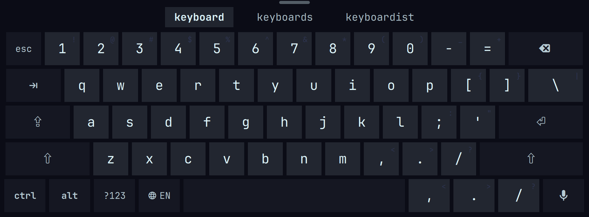
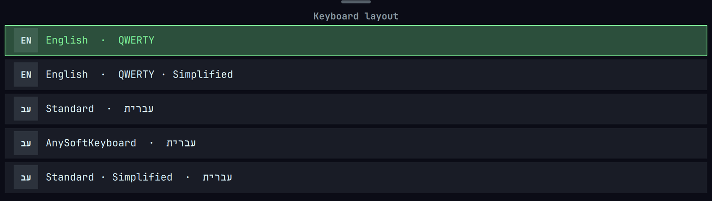
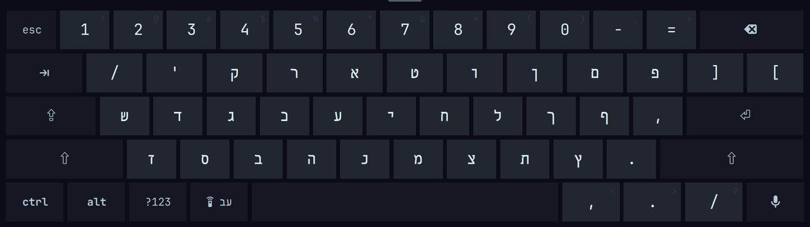
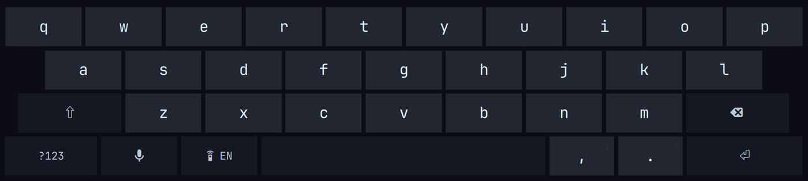
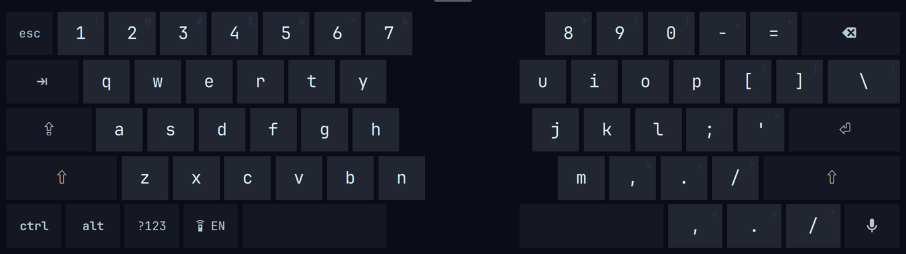
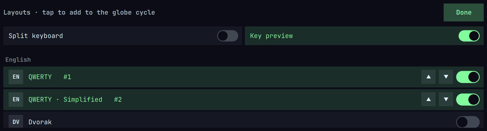

# Piccolo on-screen keyboard (`piccolo.osk`)

A touch / on-screen keyboard for the [Omarchy](https://omarchy.org/) shell
(Quickshell + Hyprland). Built for a small convertible but useful on any
Omarchy machine with a touchscreen.

- **Pops up on text-field focus** (via fcitx5) or a swipe up from the bottom
  edge, and slides windows up above it, iPad-style.
- **Real modifier chords.** `Ctrl`, `Alt` and `Super` are one-shot: tap the
  modifier, then a key. `Ctrl+C` reaches the app, `Super+Enter` reaches
  Hyprland — because keys are injected through `ydotool` as an ordinary
  keyboard, so punctuation works in Chromium and Super binds fire.
- **Two layers.** `?123` switches to F1–F12, navigation (ins/home/end/page),
  delete, a number block and the symbols without shifting.
- **22 layouts, 9 languages.** English (QWERTY · Dvorak), Español, Deutsch,
  Français, עברית, العربية, Ελληνικά, Русский and فارسی — each with a
  phone-style **Simplified** sibling. Tap the 🌐 globe to cycle, hold it to
  switch or manage.
- **Long-press accents.** Hold a key for its alternates — `é è ê`, `¿ ¡`,
  Greek tonos, Arabic hamza, `ё` — imported from AnySoftKeyboard's layout
  data plus hand-tuned sets.
- **Glide typing, suggestions and autocorrect.** Swipe across the letters to
  write a word (a comet trail follows your finger), tap candidates in the
  strip above the keys, and let the space bar fix typos — with per-language
  dictionaries fetched on first use. Autocorrect stays out of terminals.
- **Split mode.** iPad-style thumb halves, one toggle away. **Key preview**
  bubbles are a toggle too.
- **Space-bar cursor.** Drag along the space bar to move the text cursor.
- **Dictation.** If [voxtype](https://github.com/dnck/voxtype) is installed a
  microphone key toggles it.
- **Themed** entirely from the live Omarchy theme, and it shares its key
  surface with the lock screen (see below).
- Always the topmost layer, so a fullscreen window never covers it.



## Install

```bash
omarchy plugin add https://github.com/hezi/omarchy-osk.git --enable
```

Then, once, install the typing stack (`omarchy plugin add` runs no scripts):

```bash
bash ~/.config/omarchy/plugins/piccolo.osk/setup.sh
```

`setup.sh` installs `ydotool` (+ its user service), `wtype` and
`python-gobject`, and — if you use keyd — excludes ydotool's virtual device so
your injected keys aren't swallowed. The plugin also pops a one-time
notification pointing here if it loads before the stack is present.

> Heads up: shell plugins run as unsandboxed code inside your long-lived
> `omarchy-shell` process. Read the source before you enable it.

## Using it

Toggle it by hand with a keybind (add to `~/.config/hypr/bindings.lua`):

```lua
o.bind("SUPER + SHIFT + K", "Toggle on-screen keyboard", "omarchy-shell osk toggle")
```

`Shift` is one-shot; double-tap it for caps lock. Hide the keyboard by dragging the handle down.

```bash
omarchy-shell osk state                 # what it's thinking (JSON)
omarchy-shell osk setAutoShow tablet    # tablet | always | never
omarchy-shell osk setSwipe on           # bottom-edge swipe on/off
omarchy-shell osk typeText "hello"      # inject through the keyboard's path
```

Settings persist in `~/.config/omarchy/osk.json`. `autoShow` defaults to
`tablet`, which only auto-shows while `/tmp/tablet-mode.state` reads `tablet`
(written by a tablet-mode service such as the one in
[piccolo-omarchy](https://github.com/hezi/piccolo-omarchy)). On a plain laptop,
set it to `always` (auto-show whenever a field is focused) or `never` (swipe /
keybind only):

```bash
omarchy-shell osk setAutoShow always
```

## Layouts

Tap the **globe key** (shows the current language, always just left of the space
bar) to cycle the layouts you've enabled; **hold it** for the switcher, and pick
*⚙ Manage layouts…* (or `omarchy-shell osk manage`) for the settings panel —
toggle layouts in or out of the rotation, reorder the cycle, and flip **Split
keyboard** (iPad-style thumb halves) and **Key preview** (iOS-style bubbles).
Everything persists in `osk.json`.





Every layout also ships a phone-style **Simplified sibling**, listed as
*… · Simplified* in the picker.



Split mode puts the same board in two thumb halves:



Bundled layouts:

| Language | Variants |
|---|---|
| English | QWERTY · Simplified · Dvorak |
| Español | QWERTY (+accents) |
| Deutsch | QWERTZ (umlauts, ß, €) |
| Français | AZERTY (+accents) |
| עברית | Standard SI-1452 · AnySoftKeyboard |
| العربية | AnySoftKeyboard (hamza on long-press) |
| Ελληνικά | AnySoftKeyboard (tonos on long-press) |
| Русский | AnySoftKeyboard (ЙЦУКЕН + ё) |
| فارسی | AnySoftKeyboard |

```bash
omarchy-shell osk layouts               # catalog + enabled + current (JSON)
omarchy-shell osk setLayout de-qwertz   # jump to a layout
omarchy-shell osk setEnabled "en-qwerty,he-standard"   # the globe rotation
omarchy-shell osk manage                # open the settings panel
omarchy-shell osk setSplit on           # iPad-style split
omarchy-shell osk setKeyPreview on      # key preview bubbles
```



Adding a language is a data-only append to `CATALOG` in `KeyboardLayout.js`;
the builders handle widths, stagger and balance. PRs welcome.

## Suggestions, autocorrect & glide typing

A strip above the keys shows up to three candidates as you type — tap one to
replace the word you're on (the first, highlighted one is the best match).

**Autocorrect** fires when you hit space: the word is scored against the
dictionary with a keyboard-aware edit distance (substituting an adjacent key
is cheap, a transposition cheaper still), so `teh` → `the` and `keybaord` →
`keyboard`. It skips ALL-CAPS words, and turns itself off while a terminal is
focused (foot, kitty, alacritty, wezterm, ghostty, xterm, st) so `gti` stays
`gti`. After a correction the strip shows what you actually typed — tap it to
undo.

**Glide typing** lets you swipe a word instead of tapping it: slide across the
letters and lift; the decoder matches the path's shape against the dictionary
and commits the best word plus a space, with runners-up in the strip. A trail
follows your finger while you swipe. Tap-typing still works exactly as before
— short taps stay taps.

Dictionaries come from AnySoftKeyboard's language packs, one per language, and
are downloaded automatically the first time a layout in that language becomes
active (a few MB each, cached under `~/.config/omarchy/osk/dict/`). All nine
bundled languages have one; the dictionary always follows the active layout.

All three are toggles in the manage panel, or:

```bash
omarchy-shell osk setSuggest on
omarchy-shell osk setAutocorrect on
omarchy-shell osk setGlide on
```

## Pop-up on focus (fcitx5)

Focus detection uses fcitx5's DBus virtual-keyboard backend, so it needs
fcitx5 running as your input method with the virtual-keyboard addon. The
keyboard is fully usable **without** fcitx5 via the edge swipe or the keybind —
only automatic pop-up-on-focus needs it. If you already type CJK/other
languages through fcitx5 you're set; otherwise see the fcitx5 docs for the
one-time `GTK_IM_MODULE=fcitx` / `QT_IM_MODULE=fcitx` / `XMODIFIERS=@im=fcitx`
environment setup.

## Lock screen (optional)

`KeyboardView.qml` is the bare key surface, independent of injection, so a
clone of `omarchy.lock` can embed it and feed the password field directly. The
wiring lives in [piccolo-omarchy](https://github.com/hezi/piccolo-omarchy)
(`shell/lock/patch-lockview.py`); it isn't part of this plugin because it edits
a clone of the lock plugin, not this one.

## How it works

- **Focus.** A process that owns the bus name
  `org.fcitx.Fcitx5.VirtualKeyboard` gets `ShowVirtualKeyboard` /
  `HideVirtualKeyboard` calls as text fields gain and lose focus.
  `osk-bridge.py` owns that name and "arms" fcitx5 into on-screen-keyboard
  mode. fcitx5 leaves that mode the instant it sees a synthetic key, so the
  bridge re-arms it while auto-show is allowed and swallows the spurious hide
  each injected key produces.
- **Typing.** fcitx5's own forwarding drops modifier state, so keys go through
  `ydotool` (kernel uinput → a real US keyboard to every app and the
  compositor); characters off the US layout fall back to `wtype`.
- **Layering.** The keyboard is a `WlrLayer.Overlay` surface with
  `keyboardFocus: None`, so it never covers-under a fullscreen window and never
  steals focus from the field you're typing into.
- **Words.** `osk_engine.py` holds the language model: prefix suggestions from
  a frequency lexicon, autocorrect via keyboard-adjacency-weighted
  Damerau-Levenshtein distance, and SHARK²-style glide decoding (the swipe
  path is resampled and scored on shape + key locations + word frequency).
  The bridge tracks the current word from the keys it injects — nothing reads
  what other keyboards type.

## Files

```
Osk.qml            desktop wrapper: visibility, swipe strip, IPC, bridge plumbing
KeyboardView.qml   the key surface (rows, layers, modifiers) — shareable
KeyboardLayout.js  the two key layers
osk-bridge.py      fcitx5 D-Bus bridge + ydotool/wtype injection + word tracking
osk_engine.py      suggestions, autocorrect, glide decoding, dictionary fetch
setup.sh           one-time dependency install
check-deps.sh      dependency probe / first-run nag
manifest.json      Omarchy plugin manifest
```

## Uninstall

```bash
bash ~/.config/omarchy/plugins/piccolo.osk/setup.sh --remove   # ydotool service + keyd exclusion
omarchy plugin remove piccolo.osk
```

## License

MIT — see [LICENSE](LICENSE).
